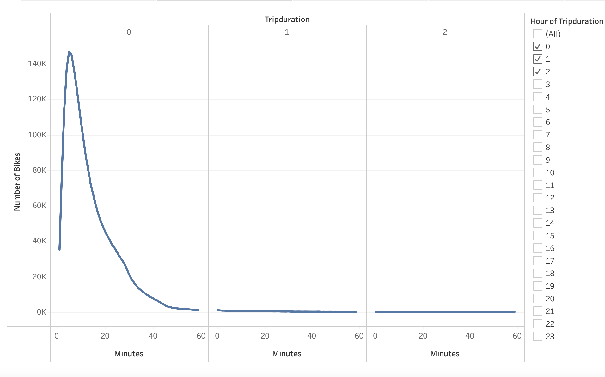

##Overview of the analysis:
 
The purpose of this analysis is to create a visualization of bike sharing data for New York City to create a proposal whether bike sharing business would be a good idea for Des Moines.
Tableau Public is used for the visualization and analysis. The Tableau Story is available at the link below.

Link to the: [NYC Bikesharing Analysis Story](https://public.tableau.com/app/profile/tesa3667/viz/NYCBikesharingAnalysis/NYCBikesharingAnalysis?publish=yes)

##Results:
 ###Checkout Times for Users
In this analysis, we compared number of customers and duration of their trips. Most trips are short approximately 10 minutes. 
 

### Checkout Times by Gender
In this analysis, users duration of trips categorized by gender. We can conclude majority users are male. 
gender.png

###Trips by Weekday per Hour
In this analysis, we created heatmap to see count of riders during peak hours of the week. We can see high usage of morning 7am to 8 am as well as between 5pm and 7pm. 

weekdayperhr.png

###Trips by Gender (Weekday per Hour)
In this analysis, we categorized trips by weekday hour by gender.

tripsbygender.png
###User Trips by Gender by Weekday
In this analysis, we compared customers and subscribers with male and female using a heat map. 

weekday.png

##Summary: 
Based on the analysis, investing in the Bike Sharing program in Des Moines would be successful. The service can provide an alternative mode of transportation since most rides are taken to commute work. Results show that bikes are more heavily used by males than females and the majority rides are taken in a highly populated area. 
Two more analysis that could be done are:
1.	Relation between and age and usage
2.	Relation between month and usage
